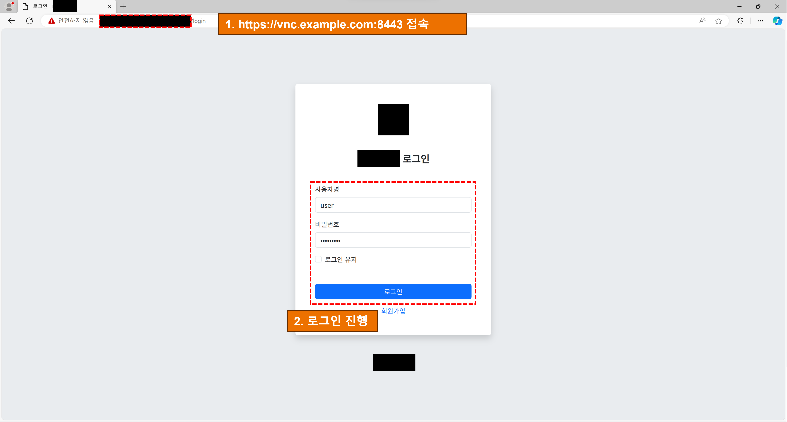
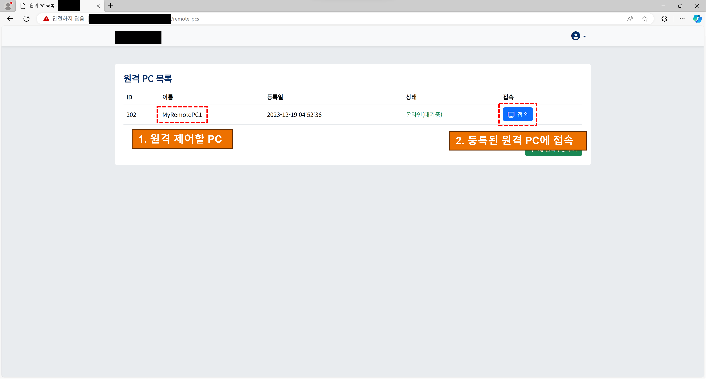
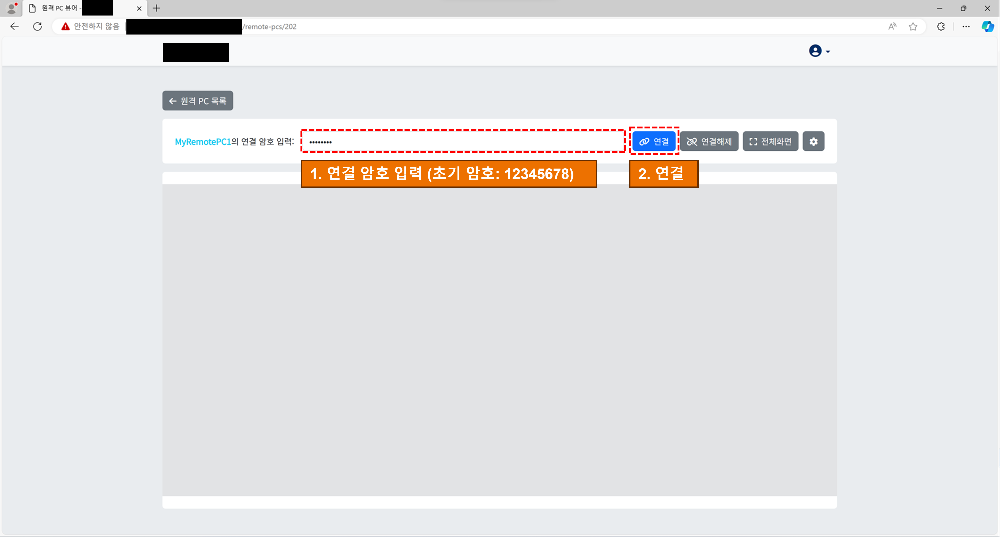
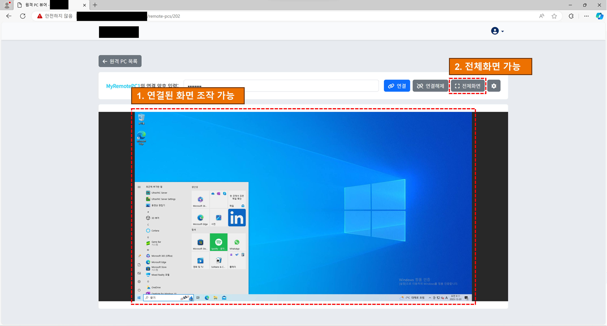
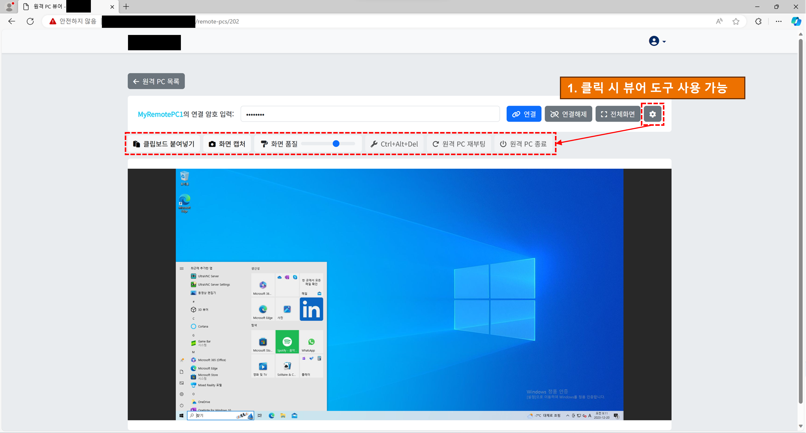
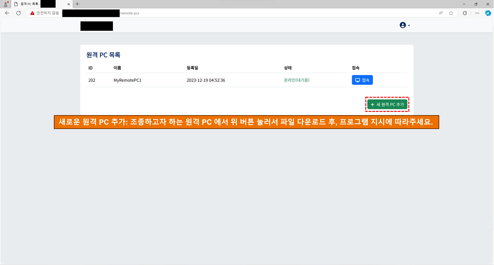
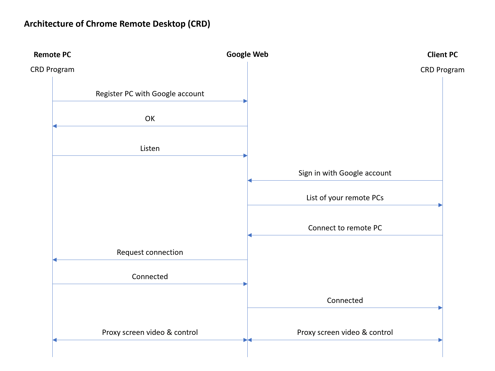
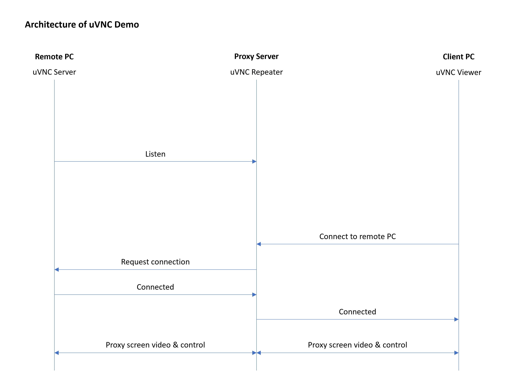
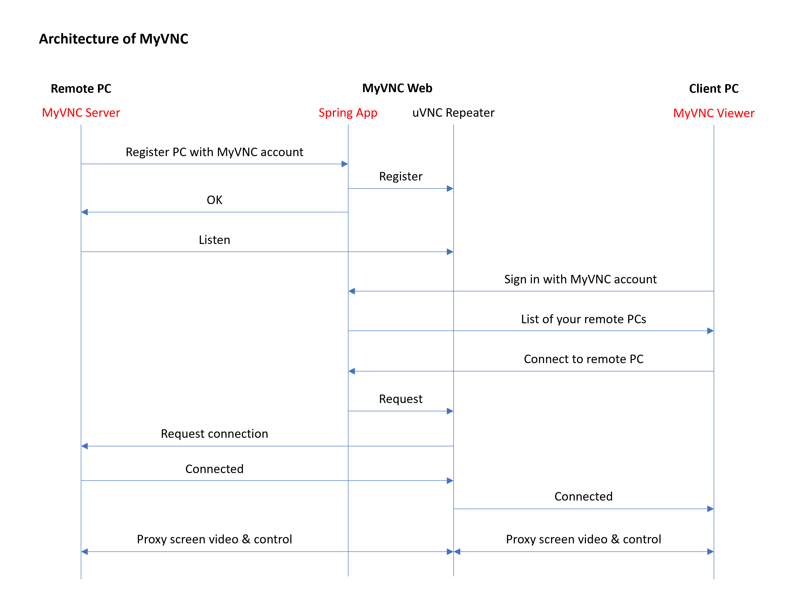
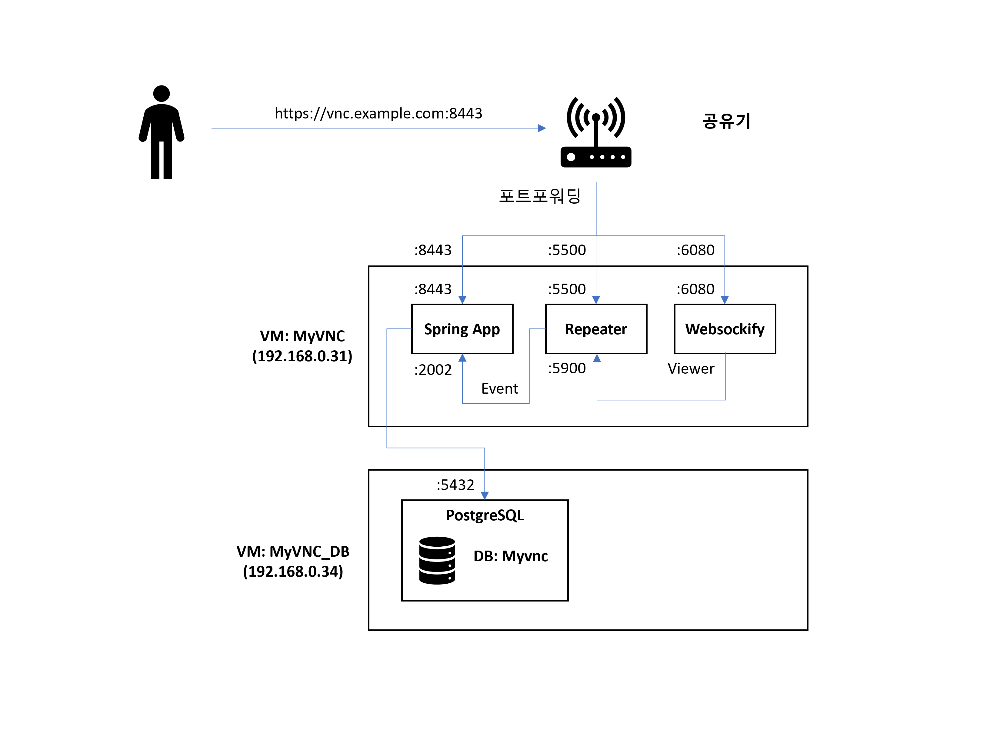

> [!TIP]
> 우측 상단의 버튼으로 **목차**를 확인할 수 있습니다.

> [!IMPORTANT]
> **🙇 보안상 이유로 전체 소스코드는 공개할 수 없습니다.**
> 
> **🔒 이 저장소는 2025-03 이후 비공개로 전환됩니다.**

# MyVNC

| 항목          | 내용 |
|--------------|------|
| 🕒 기간      | 2023-11 ~ 2023-12 |
| 👥 인원      | 1명 |
| 🛠 사용 기술 |      |
| 🎯 담당 역할 | 1) 프로그램 분석 및 설계<br/>2) 프로토타입 개발 (백엔드, 프론트엔드) |
| 📖 개요      | 온프레미스 원격 데스크톱 솔루션의 설계 및 프로토타입 개발 |

# 💡 프로젝트 개요
## 배경 및 목표
Chrome Remote Desktop (이하 CRD) 처럼 외부 서버를 거치는 원격 데스크탑 프로그램은 민감한 개인정보를 다루는 기관에서 사용하기에 제약이 있습니다. MyVNC는 신뢰할 수 있는 서버에 직접 설치하여 사용하는 온프레미스 원격 데스크탑 솔루션입니다.
## 주요 기능
### ✅ 원격 PC 제어
1. 로그인

2. 등록된 원격 PC 목록

3. 연결 암호 입력

4. 원격 PC 제어

5. 원격 PC 조작 도구


### ✅ 원격 PC 등록
1. 등록할 원격 PC에서 PC 목록 페이지 접속 후 "새 원격 PC 추가" 버튼 클릭

2. 다운로드된 데스크탑 애플리케이션을 설치
3. 애플리케이션 실행 후 로그인시 연결 대기 상태

# 🔥 나의 기여
## 1️⃣ 프로그램 분석, 설계
### 상황
다음과 같은 비즈니스 요구사항이 있었습니다.

"장비관리 및 접속을 내부에서 통제하여 보안성을 유지"

이를 달성하기 위해 온프레미스 형태로 사용 가능한 원격 PC 제어 솔루션을 설계하는것이 목표였습니다.

### 선행 기술 분석
설계를 위해 기존 선행 기술인 Chrome Remote Desktop 프로그램을 분석하고 시퀀스 다이어그램을 작성했습니다.



실제 제어 통신은 P2P로 일어나더라도, 회원 및 장비 관리 통신이 구글 서버를 거치는 문제점이 있습니다.

### 사용 라이브러리 분석
VNC 프로토콜을 사용하기 위해 [UltraVNC](https://github.com/ultravnc/UltraVNC) 라이브러리를 사용했습니다.

오픈소스이면서 서버 애플리케이션과의 통합을 위해 UltraVNC Repeater라는 편리한 툴을 제공해주기 때문에 선정했습니다.

UltraVNC Repeater는 UltraVNC Server와 Viewer 사이에서 프록시 역할을 하며, NAT 방화벽 뒤에서도 포트 포워딩 없이 원격 접속을 가능하게 해주는 중계 서버입니다.

설계를 위해 UltraVNC의 작동 방식을 분석하고 시퀀스 다이어그램을 작성했습니다.



### 최종 설계 도출

CRD에서 구글 서버를 거치는 부분을 온프레미스 Spring App으로 교체하고 UltraVNC 라이브러리를 이용하여 시퀀스 다이어그램을 작성했습니다.



전체 구조는 다음과 같습니다.



### 결과
"기존 프로그램 분석 → 문제점 도출 → 기술 선정 → 문제 해결을 위한 설계 작성" 이라는 과정을 거치며 비즈니스 요구사항을 만족하기 위한 설계를 작성할 수 있었습니다.

본 설계 과정을 통해 1) 프로토타입 개발에 도움이 되었을 뿐만 아니라 2) 동료 개발자분들께 최종 설계를 이해시키고 정당성을 납득시키는데에도 큰 도움이 되었습니다.

## 2️⃣ TCP 이벤트 메시징
### 상황
온프레미스 환경에서 연결, 제어등을 관리하고 통제하기 위해서는 Spring App에서 UltraVNC의 이벤트(PC 연결, 해제, 제어 등)를 받아올 필요가 있었습니다.

UltraVNC를 사용한 핵심적인 이유 중 하나가 다양한 이벤트(PC 등록, 연결, 해제, 제어 등)를 TCP 메시지를 통해 제공하기 때문입니다.

따라서 이 메시지를 받고 사용하는 기능을 구현하는것이 목표였습니다.

### UltraVNC 설정
UltraVNC의 설정 파일에 다음과 같이 작성하여 이벤트 메시지 기능을 활성화하고 메시지를 보낼 목적지를 설정할 수 있습니다.
```ini
[eventinterface]
useeventinterface = true

eventlistenerhost = 127.0.0.1
eventlistenerport = 2002
```

### 메시지 객체 정의
UltraVNC에서 생성되는 메시지의 형태를 참고하여 이에 매핑시킬 객체를 다음과 같이 작성하였습니다.

```java
@Data
public class EventMessage {

    private int evMsgVer;
    private int evNum;
    private long time;
    private int pid;
    private int tblInd;
    private long code;
    private int mode;
    private String ip;

    private int svrTblInd;
    private int vwrTblInd;
    private String svrIp;
    private String vwrIp;

    private int maxSessions;

    public Long getRepeaterId() {
        return code;
    }

    public static enum EvNum {
        VIEWER_CONNECT,                 // 0
        VIEWER_DISCONNECT,              // 1
        SERVER_CONNECT,                 // 2
        SERVER_DISCONNECT,              // 3
        VIEWER_SERVER_SESSION_START,    // 4
        VIEWER_SERVER_SESSION_END,      // 5
        REPEATER_STARTUP,               // 6
        REPEATER_SHUTDOWN,              // 7
        REPEATER_HEARTBEAT              // 8
    }
}
```

### 메시지 수신
Spring Integration을 이용하여 다음과 같이 Spring App에서 TCP 메시지를 수신할 수 있습니다.

향후 확장성과 Spring 생태계와의 통합을 고려하여 Spring Integration을 사용하였습니다.

1. TCP 서버 설정
```java
@Configuration
@EnableIntegration
public class TcpServerConfig {

    @Value("${tcp.server.port}")
    private int port;

    @Bean
    public AbstractServerConnectionFactory connectionFactory() {
        TcpNioServerConnectionFactory connectionFactory = new TcpNioServerConnectionFactory(port);
        connectionFactory.setSerializer(TcpCodecs.lf());
        connectionFactory.setDeserializer(TcpCodecs.lf());
        return connectionFactory;
    }

    @Bean
    public TcpInboundGateway inboundGateway(AbstractServerConnectionFactory connectionFactory) {
        TcpInboundGateway tcpInboundGateway = new TcpInboundGateway();
        tcpInboundGateway.setConnectionFactory(connectionFactory);
        tcpInboundGateway.setRequestChannelName("inboundChannel");
        return tcpInboundGateway;
    }
}
```

2. 엔드포인트 설정

```java
@MessageEndpoint
public class TcpServerEndpoint {
    private final MessageService messageService;

    public TcpServerEndpoint(MessageService messageService) {
        this.messageService = messageService;
    }

    @ServiceActivator(inputChannel = "inboundChannel", async = "true")
    public void process(byte[] message) {
        messageService.processMessage(message);
    }
}
```

### 결과
위와 같이 Spring Integration을 통해 TCP 이벤트 메시지를 수신하도록 구현함으로써 `MessageService`에서 `EventMessage`객체를 통해 다양한 제어를 위한 비즈니스 로직을 수행할 수 있었습니다.
